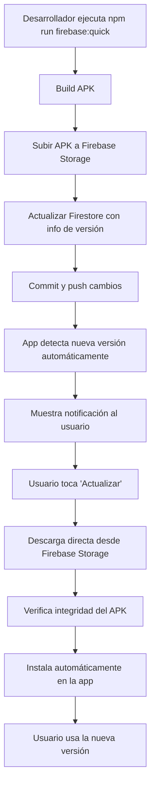

# 🔥 Sistema de Actualizaciones Automáticas con Firebase Storage

Este documento explica cómo usar el nuevo sistema de actualizaciones automáticas que utiliza Firebase Storage en lugar de GitHub, permitiendo que los usuarios actualicen la app directamente sin salir de la aplicación.

## 🚀 **Comandos de Deploy Disponibles**

### **🔥 Comandos Firebase (RECOMENDADOS)**
```bash
# Deploy rápido a Firebase Storage (patch)
npm run firebase:quick

# Deploy con incremento minor
npm run firebase:quick:minor

# Deploy con incremento major  
npm run firebase:quick:major

# Deploy completo a Firebase (patch)
npm run firebase:deploy

# Deploy completo a Firebase (minor)
npm run firebase:deploy:minor

# Deploy completo a Firebase (major)
npm run firebase:deploy:major
```

### **📱 Scripts directos**
```bash
# Usando el script rápido
node firebase-quick-deploy.js patch
node firebase-quick-deploy.js minor
node firebase-quick-deploy.js major

# Usando el script completo
node firebase-deploy.js patch --clean --auto
node firebase-deploy.js minor --clean --auto --help
```

## 🎯 **Comando Más Recomendado**

Para actualizaciones regulares:
```bash
npm run firebase:quick
```

Este comando:
- ✅ Incrementa automáticamente la versión patch
- 🧹 Limpia archivos antiguos 
- 🔨 Construye React + Capacitor + Android APK
- ☁️ Sube el APK a Firebase Storage
- 🔄 Actualiza la información en Firestore
- 📤 Commitea y pushea los cambios
- 🔥 Hace la actualización disponible para descarga automática

## 📋 **Cómo Funciona el Sistema**

### **1. Deploy del Desarrollador**
1. El desarrollador ejecuta `npm run firebase:quick`
2. Se construye la nueva versión del APK
3. El APK se sube a Firebase Storage (`releases/namustock-[version].apk`)
4. Se actualiza Firestore (`appConfig/version`) con la nueva información
5. Se commitean los cambios al repositorio

### **2. Detección Automática**
1. La app verifica automáticamente cada 5 minutos si hay nuevas versiones
2. Consulta Firestore para obtener la información de la última versión
3. Compara con la versión instalada
4. Si hay una nueva versión, muestra una notificación

### **3. Descarga e Instalación Automática**
1. El usuario toca "Actualizar" en la notificación
2. La app descarga el APK directamente desde Firebase Storage
3. Verifica la integridad y seguridad del archivo
4. Instala automáticamente sin salir de la app
5. **No necesita abrir el navegador**

## 🔧 **Configuración Requerida**

### **Prerrequisitos**
```bash
# Firebase CLI instalado y autenticado
npm install -g firebase-tools
firebase login
firebase use namu-inv
```

### **Estructura de Firebase**
- **Storage**: `releases/namustock-[version].apk`
- **Firestore**: `appConfig/version` con estructura:
```json
{
  "version": "1.1.68",
  "storagePath": "releases/namustock-1.1.68.apk",
  "notes": "Nueva versión disponible...",
  "fileSize": "25.4 MB",
  "fileSizeBytes": 26632192,
  "releaseDate": "2024-01-15T10:30:00Z",
  "platform": "android",
  "type": "firebase-storage"
}
```

## 🔄 **Flujo Completo de Actualización**



## 📱 **Experiencia del Usuario**

### **Antes (GitHub)**
1. App detecta actualización
2. Abre navegador
3. Descarga APK manualmente
4. Instala manualmente
5. Vuelve a la app

### **Ahora (Firebase Storage)**
1. App detecta actualización automáticamente
2. Muestra notificación en la app
3. Usuario toca "Actualizar"
4. Descarga e instalación automática
5. **¡Sin salir de la app!**

## 🛡️ **Seguridad y Verificaciones**

- ✅ **Verificación de integridad**: Checksum SHA-256 del APK
- ✅ **Validación de estructura**: Verifica que es un APK válido de Android
- ✅ **Tamaño razonable**: Valida que el archivo tenga un tamaño esperado
- ✅ **Origen verificado**: Solo acepta archivos de Firebase Storage autorizado
- ✅ **Permisos del sistema**: Solicita permisos de instalación cuando es necesario

## 🔍 **Monitoring y Debug**

### **Logs importantes**
```javascript
// En la consola del navegador/app
console.log('🔥 Firebase inicializado para actualizaciones');
console.log('📱 Última versión disponible:', latestVersion);
console.log('✅ URL de descarga obtenida desde Firebase Storage');
console.log('🔒 Verificación de seguridad completada exitosamente');
```

### **Verificar estado en Firebase**
1. **Firestore**: `appConfig/version` debe contener la información más reciente
2. **Storage**: `releases/` debe contener los APKs subidos
3. **Logs**: Revisar Firebase Console para errores de subida/acceso

## 🚨 **Troubleshooting**

### **Error: "Firebase CLI no está instalado"**
```bash
npm install -g firebase-tools
firebase login
```

### **Error: "No se pudo subir a Firebase Storage"**
```bash
# Verificar autenticación
firebase auth:list

# Verificar proyecto actual
firebase use

# Cambiar al proyecto correcto
firebase use namu-inv
```

### **Error: "APK no se descarga en la app"**
- Verificar que Firestore tenga la información correcta
- Verificar permisos de lectura en Firebase Storage
- Verificar reglas de seguridad en Firebase Console

## 📈 **Ventajas del Nuevo Sistema**

| Aspecto | GitHub (Anterior) | Firebase Storage (Nuevo) |
|---------|------------------|--------------------------|
| **Experiencia** | Sale de la app | Se queda en la app |
| **Velocidad** | Lenta (redirect) | Rápida (directa) |
| **Seguridad** | Navegador | Verificada en la app |
| **Automatización** | Parcial | Completamente automática |
| **Dependencias** | GitHub CLI | Firebase CLI |
| **Fiabilidad** | Media | Alta |

## 🎉 **¡Ya está listo!**

Con este sistema, tus usuarios tendrán actualizaciones **completamente automáticas** sin salir jamás de la aplicación. Es una experiencia mucho más profesional y fluida.

**¿Qué hacer ahora?**
1. Ejecuta `npm run firebase:quick` para tu primera actualización
2. Prueba el sistema en un dispositivo de test
3. ¡Disfruta de las actualizaciones automáticas!

---
*Sistema implementado con ❤️ para una experiencia de usuario superior*